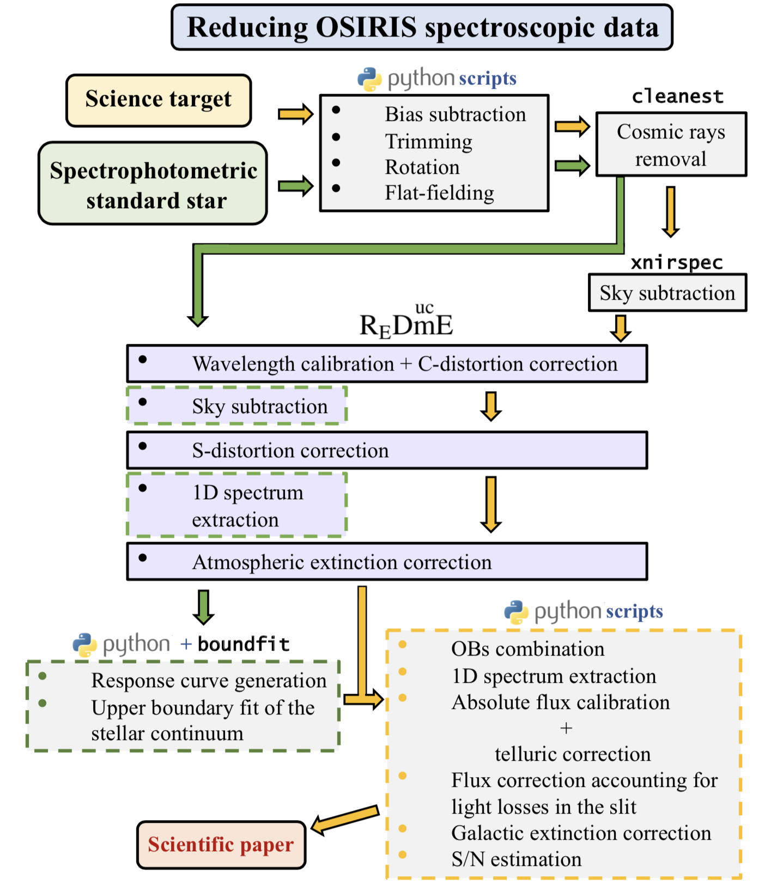

# OSIRIS

This is the source code repository for the python routines employed to calibrate the reduced optical spectra from the OSIRIS spectrograph at GTC.

This software was created by C. Cabello as part of her thesis work, developed under the supervision of N. Cardiel and J. Gallego, at the Departamento de Física de la Tierra y Astrofísica of the Universidad Complutense de Madrid.

The program is first mentioned in Paliya et al. 2020 (see https://ui.adsabs.harvard.edu/abs/2020ApJ...903L...8P/abstract) and Cabello, C. - PhD Thesis 2023.

Maintainer: Cristina Cabello, criscabe@ucm.es Webpage (source): https://github.com/criscabe/OSIRIS

  

</a>

